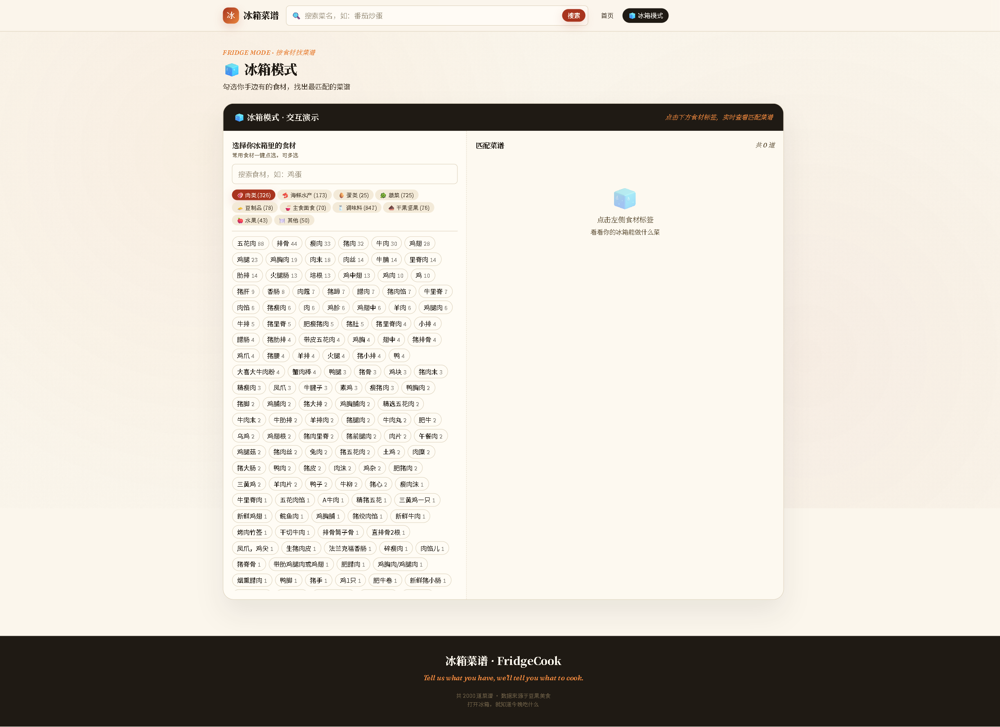

# 冰箱菜谱 · FridgeCook

打开冰箱，就知道今晚吃什么。

一个基于食材匹配的菜谱推荐网站，支持关键词搜索、冰箱模式（按已有食材匹配菜谱）、难度/耗时筛选等功能。

## 功能特性

- **关键词搜索**：快速查找菜名
- **冰箱模式**：勾选冰箱里已有的食材，系统按匹配度从高到低推荐菜谱
- **智能筛选**：支持难度（初级/中级/高级）、耗时（15分钟以内/30分钟/1小时以内/1小时以上）、分类筛选
- **菜谱详情**：包含食材清单、烹饪步骤、视频播放（部分菜谱）
- **随机推荐**：不知道吃什么？一键随机推荐一道菜谱
- **食材分类**：肉类、海鲜水产、蛋类、蔬菜、豆制品、主食面食、调味料、干果坚果、水果等
- **温暖厨房美学**：纸张纹理背景、衬线字体、酒红/南瓜金配色

## 技术栈

**后端**：
- FastAPI
- SQLite
- Pandas（数据预处理）

**前端**：
- React 18
- React Router
- Tailwind CSS
- Vite

## 运行效果图

### 首页


### 冰箱模式


### 菜谱详情


## 快速启动

### 方式一：一键启动（推荐）

双击 `start.bat`，自动启动后端和前端。

### 方式二：手动启动

**1. 启动后端**

```bash
# 安装依赖
pip install -r backend/requirements.txt

# 启动服务（默认端口 8000）
python -m uvicorn backend.main:app --host 127.0.0.1 --port 8000 --reload
```

**2. 启动前端**

```bash
cd frontend

# 安装依赖（首次启动）
npm install

# 启动开发服务器（默认端口 5173）
npm run dev
```

访问 http://127.0.0.1:5173 即可使用。

## 项目结构

```
zsp1/
├── backend/              # 后端代码
│   ├── main.py          # FastAPI 入口
│   ├── database.py      # 数据库连接
│   ├── models.py        # 数据模型
│   └── routers/         # API 路由
│       ├── recipes.py   # 菜谱接口
│       ├── ingredients.py # 食材接口
│       └── categories.py  # 分类接口
├── frontend/            # 前端代码
│   ├── src/
│   │   ├── pages/       # 页面组件
│   │   │   ├── Home.jsx       # 首页
│   │   │   ├── FridgeMode.jsx # 冰箱模式
│   │   │   └── RecipeDetail.jsx # 菜谱详情
│   │   ├── components/  # 通用组件
│   │   └── api/         # API 封装
│   └── package.json
├── data/                # 数据文件
│   ├── recipes.db       # SQLite 数据库（2000 条菜谱）
│   ├── ingredients_list.json  # 食材列表（含分类）
│   └── categories_list.json   # 分类列表
├── scripts/             # 脚本
│   └── preprocess.py    # 数据预处理脚本
└── README.md
```

## 数据说明

- 原始数据：50000 条菜谱（来自豆果美食）
- 筛选后：2000 条高质量菜谱
- 预处理：清洗、去重、食材分类、难度归一化、耗时归一化

## 冰箱模式原理

用户勾选冰箱里已有的食材后，系统计算每道菜谱的匹配度：

```
match_ratio = matched_ingredients / total_ingredients
```

按匹配度从高到低排序，推荐最合适的菜谱。

## 开发说明

**后端 API 文档**：启动后端后访问 http://127.0.0.1:8000/docs

**前端构建**：
```bash
cd frontend
npm run build
```

## License

MIT
